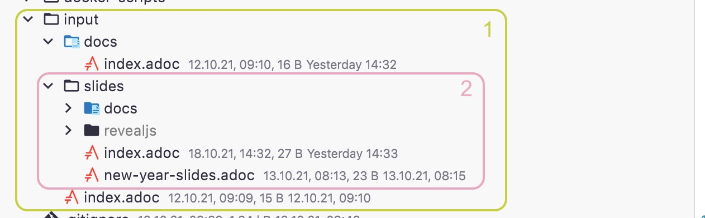

# asciidoctor-convert-action

## Description

This Action converts adoc files into html files. If `slies` option is set to true the the builder will build slides with reveal 
js in the slides directory of the input directory.



1. Compile to normal asciidoc documents in html
2. Compile to reveal js slides

## Usage

```yaml
name: Build
uses: quirinecker/asciidoctor-convert-action@1.0
with:
  slides: true
  inputPath: input
  outputPath: output
```

In this case this action will build the html files like docs but the documents in the `slides` directory like slides. 
The other options define the input and the output directory. Where are the `.adoc` files placed and where are the files compiled to.

### Parameters

|              | inputPath | outputPath | slides         |
|--------------|-----------|------------|----------------|
| isOptional   | true      | true       | true           |
| defaultValue | input     | output     | true           |
| type         | string    | string     | boolean        |
